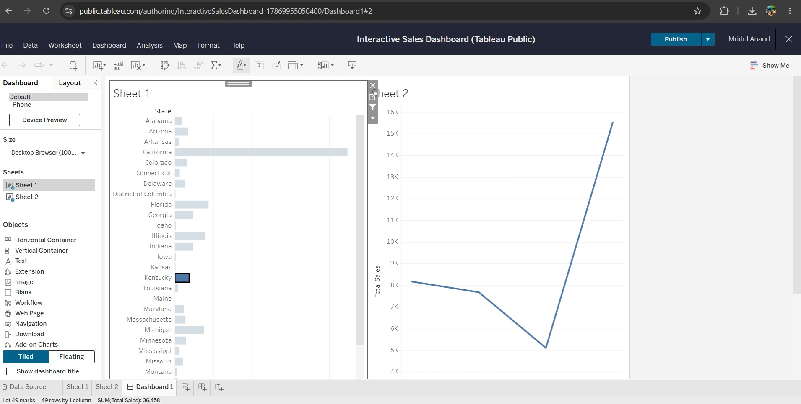

# Superstore Sales Data Analysis 

## Project Overview
Built an end-to-end data pipeline to analyze regional market performance. Processed raw datasets using SQL to extract geographic and temporal revenue metrics, and deployed an interactive Tableau dashboard for visual data interpretation.

**🔗 [Click Here to View the Interactive Tableau Dashboard](https://public.tableau.com/authoring/InteractiveSalesDashboard_17869955050400/Dashboard1#1)**

## 📈 Dashboard Preview

## 🛠️ Technical Workflow
1. **Data Engineering (SQL):** Executed data querying, aggregation, and multi-variable grouping to clean and structure the temporal dataset.
2. **Data Visualization (Tableau):** Mapped geographic sales distributions and engineered dynamic filter actions, connecting state-level data to historical revenue time-series charts.
